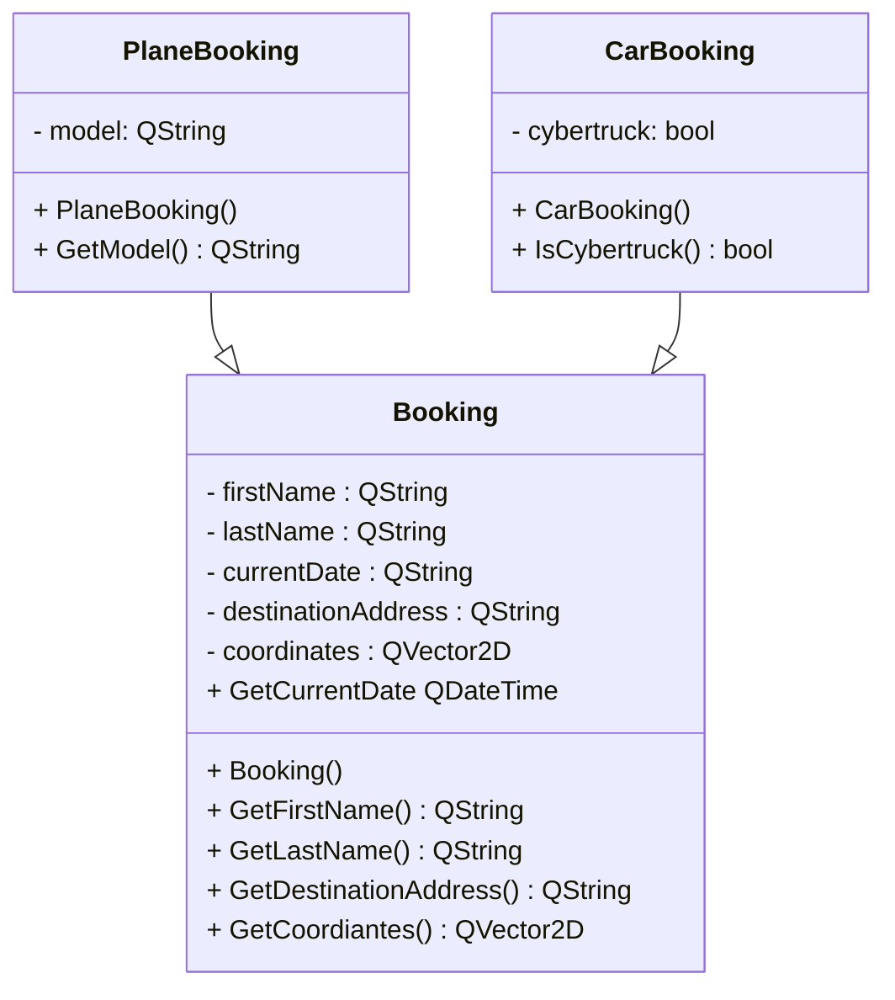

# GUBER

### Classes
Required headers:
- #include <<huh>QString>
- #include <<huh>QVector2D>
- #include <<huh>QDateTime>
- #include <<huh>QDataStream>


\
The above three classes will contain in and out operator for the QDataStream type.

```cpp
QDataStream& operator <<(QDataStream &stream, const CarBooking& booking);
QDataStream& operator >>(QDataStream &stream, CarBooking& booking);
```