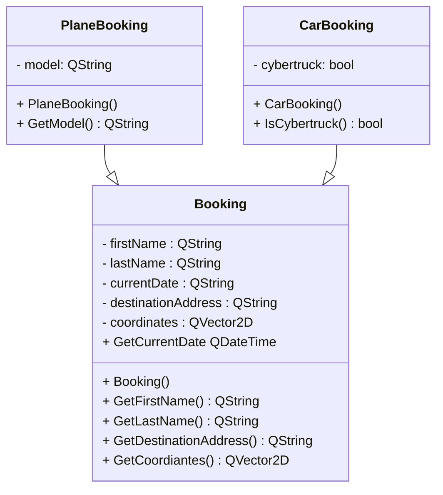
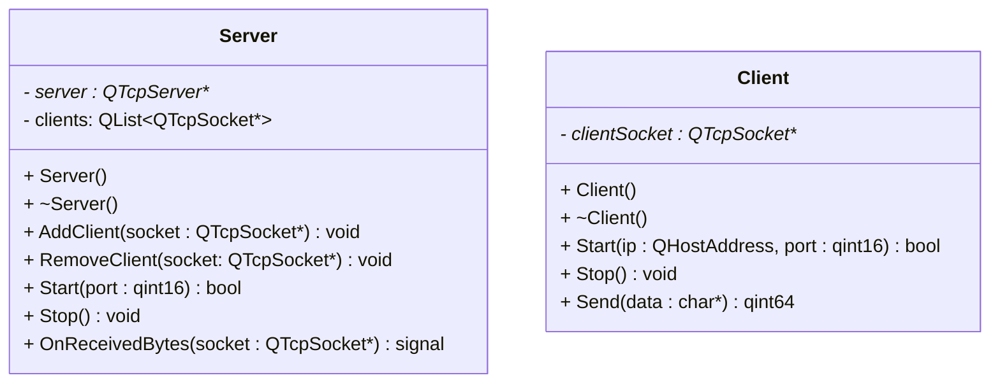

<style>
@font-face {
  font-family: 'Uber';
  src: url('Fonts/UberMoveBold.otf') format('woff')
}
.custom-font {
  font-family: 'Uber', sans-serif;
}
</style>

<h1 class="custom-font">GUBER</h1>

## Classes
### Bookings
Required headers:
- #include <<huh>QString>
- #include <<huh>QVector2D>
- #include <<huh>QDateTime>
- #include <<huh>QDataStream>


\
The above three classes will contain in and out operator for the QDataStream type.

```cpp
QDataStream& operator <<(QDataStream& stream, const CarBooking& booking);
QDataStream& operator >>(QDataStream& stream, CarBooking& booking);
```

### Network
Required headers:
- #include <<huh>QTcpServer>
- #include <<huh>QTcpSocket>
- #include <<huh>QList>
- #include <<huh>QByteArray>

