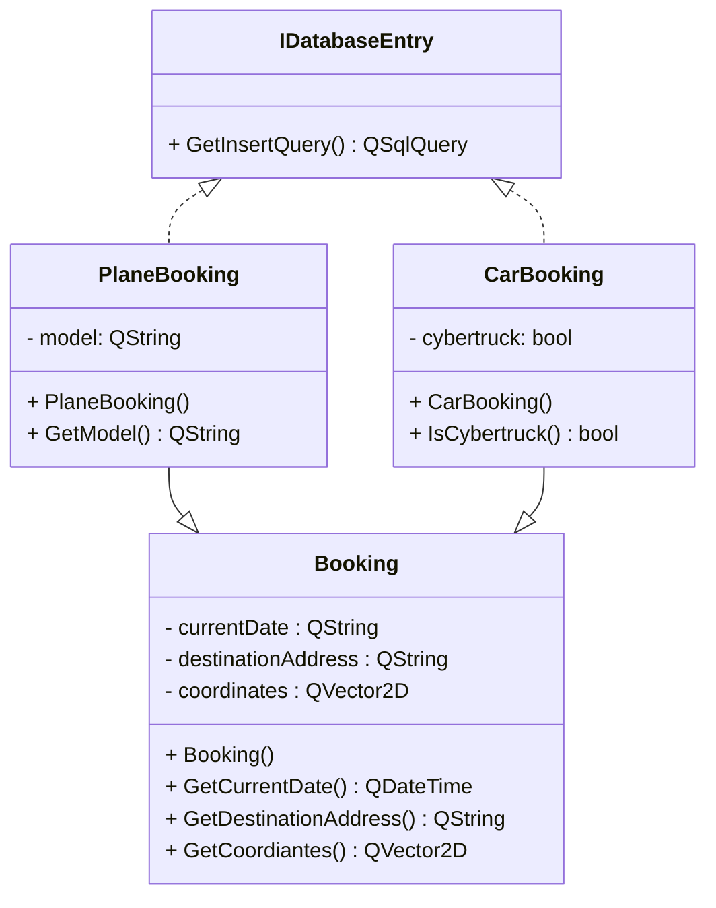
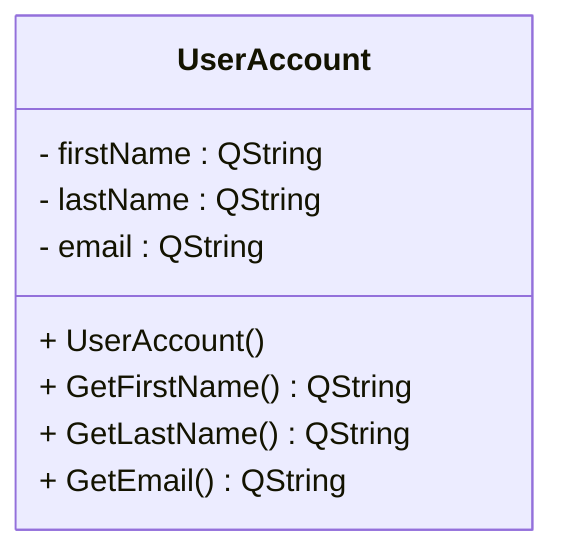
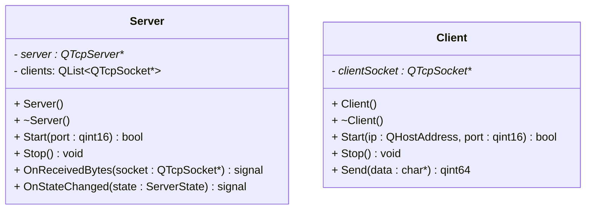
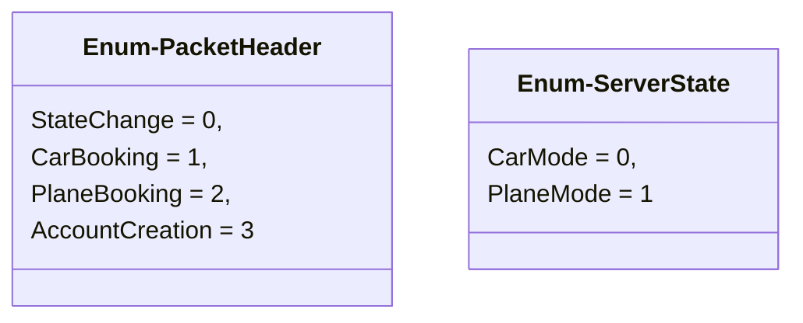
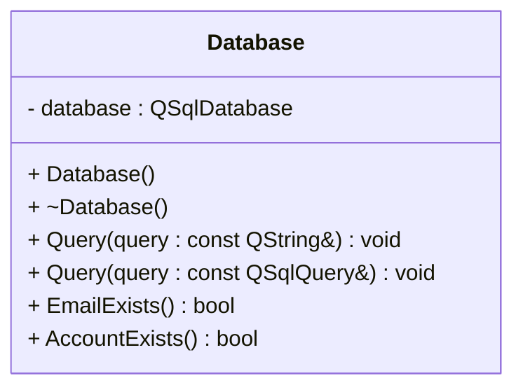

# GUBER

## Classes
### Bookings
Required headers:
- #include <<huh>QString>
- #include <<huh>QVector2D>
- #include <<huh>QDateTime>
- #include <<huh>QDataStream>
- #include <<huh>QSqlQuery>
- #include <<huh>QDataStream>





\
The above three classes will contain in and out operator for the QDataStream type.

```cpp
QDataStream& operator <<(QDataStream& stream, const CarBooking& booking);
QDataStream& operator >>(QDataStream& stream, CarBooking& booking);
```

### Network
Required headers:
- #include <<huh>QTcpServer>
- #include <<huh>QTcpSocket>
- #include <<huh>QList>
- #include <<huh>QByteArray>




### Database
Required headers:
- #include <<huh>QSql>
- #include <<huh>QSqlQuery>

